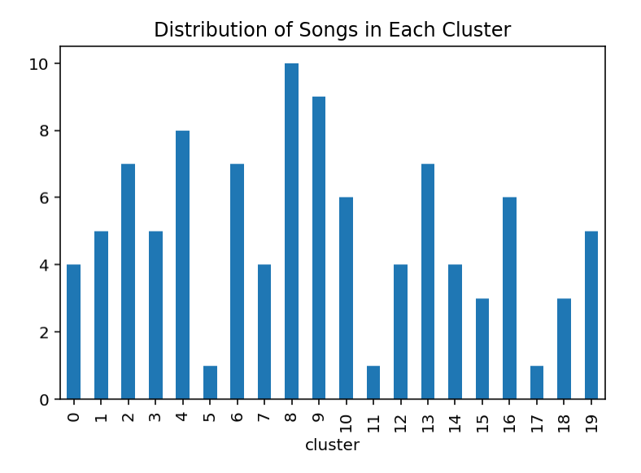
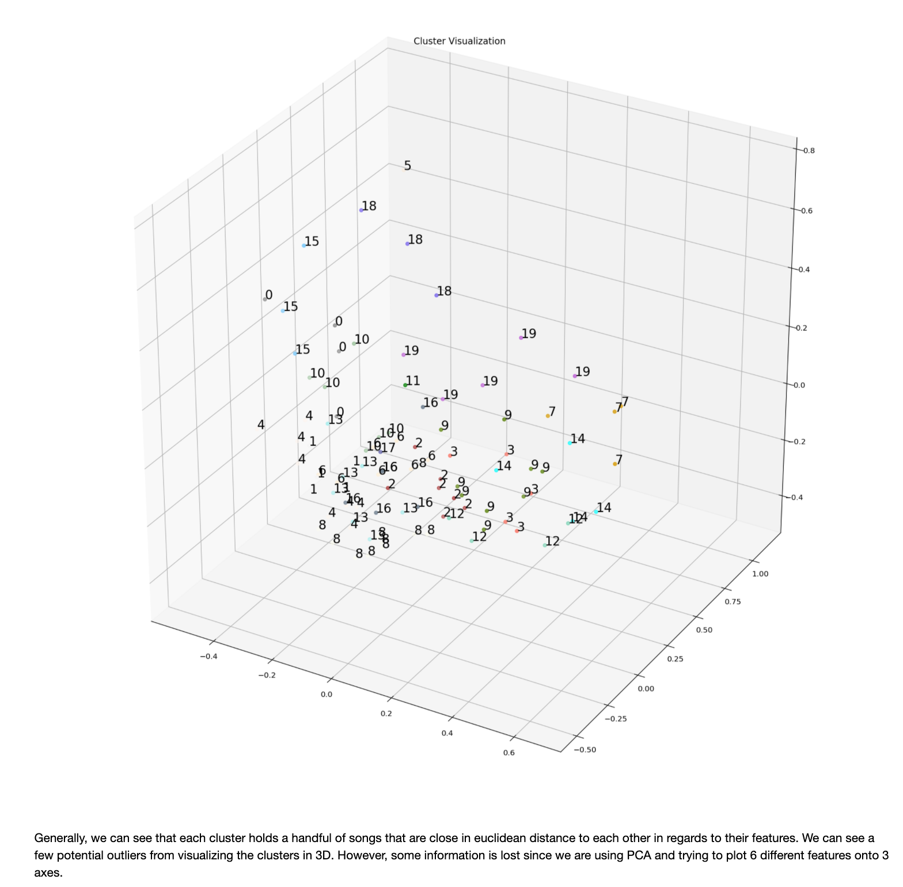
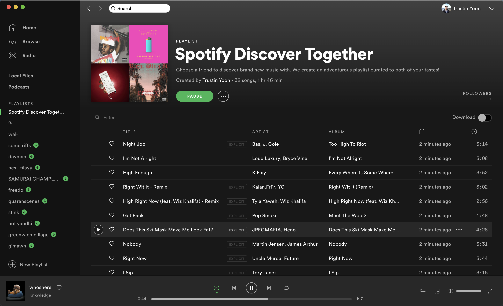

# Spotify-Discover-2gether
Choose a friend to discover brand new music with. We create an adventurous playlist curated to both of your tastes.

## Goal
Analyze and synthesize 2 users' Spotify recent taste profiles so that we can create a playlist filled with brand new song recommendations for both of them to discover together. The playlist we curate will automatically end up in both of their spotify libraries. A novel way for people to socialize because the playlist is unique to them and can create a special experience for both to find new music together that matches their music tastes.

## Data Collection
We used Spotipy, a lightweight Python library for the Spotify Web API and created a Spotify Developers app to gain authorization to Spotify profile data. Here is the official Spotipy documentation: https://spotipy.readthedocs.io/en/2.13.0/

Also forked authorization flow codes from Plegas Gerasimos's repo that contained the codes for granting authorization flows which can be found here: https://github.com/makispl/Spotify-Data-Analysis

Then we created a code that authorizes access to a user's Spotify profile to extract their top 50 medium term songs using Spotipy's current_user_top_tracks() function. medium_term was the most optimal time frame since short_term songs were too short (~1 week of songs) and long_term was too long (basically a user's all time song history). The user's top 50 medium term songs were then extracted into a csv file, and this was repeated for the second user.

## Clustering
Now that we had both users' top 50 songs, we can use those tracks for reference to recommend new songs that are curated for both people's recent music tastes. K-means clustering was the method we chose so that we could group each song from our combined songs into a cluster (sub-genre/type of song) regarding their sonic features that are officially provided by Spotify. These features include: danceability, energy, key (musical key), loudness, mode (minor or major), speechiness, acousticness, instrumentalness, liveness, valence (how positive/happy/cheerful it sounds), and tempo.	We chose to focus on danceability, energy, speechiness, acousticness, valence, and tempo after concluding the other features were noise to our analysis. We also chose to have k=20 even though the elbow method showed that optimal k=6 since we wanted to have more specified clusters so that we could base our recommended songs off less generalized clusters.

 
 

 

## Building the Playlist Creator
Once we got a list of songs for each cluster, we fed each list into Spotipy's recommendation() function which takes in 5 seed tracks to base its recommendation from. For the clusters that contained more than 5 songs, we randomly chose 5 from its list to represent the cluster. The clusters that contained less than 5 songs, we left it as is. We ran the recommendation function for each cluster, and each time it produced 1 recommended track for the clusters that contained less than 5 songs and 2 recommended tracks for the clusters that contained 5 songs. We wanted to put more weight onto the clusters with more songs since that meant we generally enjoyed songs that fit in those clusters moreso than the smaller clusters. After fetching all the recommended tracks, we put it into a list and called another Spotipy function that automatically creates and places a playlist with a given list of songs straight to the user's Spotify library.

## Conclusion
 
Arjun and I were actually able to find hidden gems in the recommended playlist that we both enjoyed. Overall it was a success, and going forward we are looking to develop this idea into a functioning web app that anyone and his/her friend can use to find music together.
